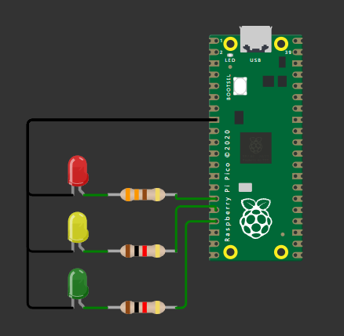

# Temporizador periódico

## Descrição
Com o emprego da função add_repeating_timer_ms(), presente 
na ferramenta Pico SDK, projete um semáforo com 
temporização  de  3  segundos  para  cada  alteração  de  sinal

Neste projeto, você deverá utilizar os seguintes componentes conectados à placa BitDogLab: 
1. Microcontrolador Raspberry Pi Pico W. 
2. 03 LEDs (vermelho, amarelo e verde). 
3. 03 Resistores de 330 Ω. 
 
Os requisitos para a realização desta atividade são: 
1. O  acionamento  dos  LEDs  (sinais  do  semáforo)  deve  iniciar  na  cor vermelha, alterando para amarela e, em seguida, verde.

2. O temporizador deve ser ajustado para um atraso de 3 segundos 
(3.000ms). 
 
3. A mudança de estado dos LEDs deve ser implementa na função 
de call-back do temporizador, a exemplo da rotina trabalhada na 
aula síncrona - repeating_timer_callback(). 
 
4. A rotina principal, presente no interior da estrutura de 
repetição while, deve imprimir algum tipo de informação a cada 
segundo (1.000 ms) - a mensagem enviada pela porta serial fica 
a critério do discente. 
 
5. Com  o  emprego  da  Ferramenta  Educacional  BitDogLab,  faça um experimento com o código deste exercício utilizando o LED RGB – GPIOs 11, 12 e 13.

## Circuito

## Como compilar
Para compilar o programa, utilize um compilador C, gerando os arquivos `.uf2` e `.elf`. Siga os passos abaixo:

1. Configure o ambiente de desenvolvimento para o Raspberry Pi Pico.
2. Compile o código utilizando um compilador compatível.

## Como executar
Após a compilação, execute o simulador Wokwi clicando no arquivo `diagram.json`:

Para testar, clique em "Play" no Wokwi e explore o circuito.

Para colocar na placa, clique em "compile" e em "run" com a placa conectada.

## Requisitos
- Compilador C (gcc ou equivalente).
- Sistema operacional compatível com programas C.
- Extensão Raspberry Pi Pico.
- Wokwi configurado no VS Code.
- Placa Raspberry Pi Pico - BitDogLab

## Desenvolvedora
- [Evelyn Suzarte](https://github.com/Evelynsuzarte)
